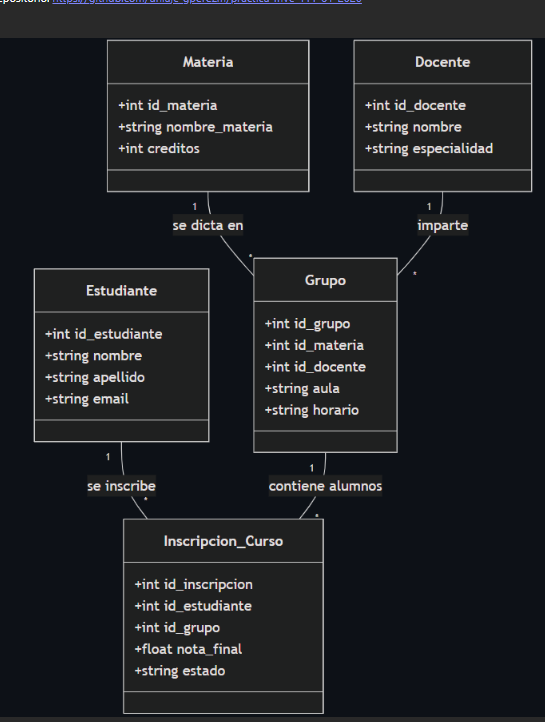

# Proyecto TALLERP


## Descripción

Este repositorio contiene la aplicación de gestión de clases, con controladores, modelos y vistas para docentes, estudiantes, grupos, inscripciones y materias.

## Colaboradores

- Jennifer Villa
- Samir Hurtado

## Cómo usar

```bash
mvn compile
mvn package
```

### clases
